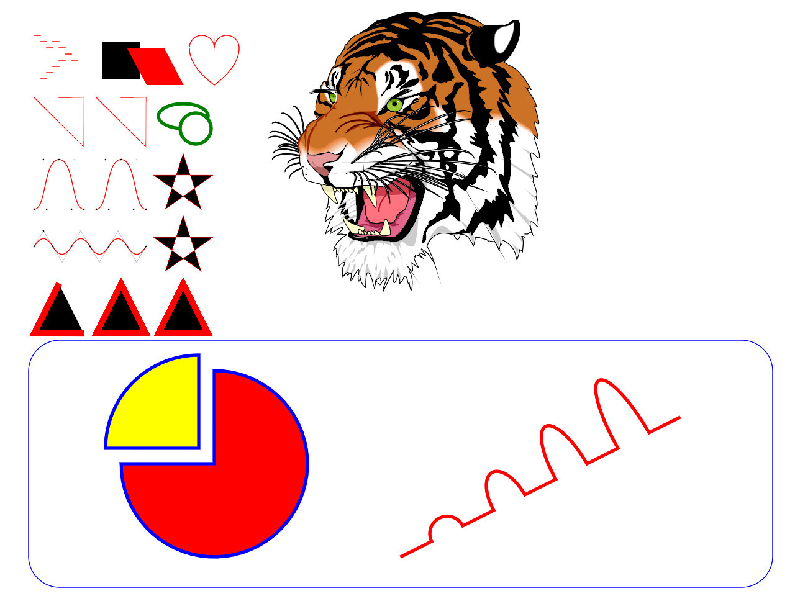

# lövector - LÖVE-ly vector graphics

lövector is a pure-lua vector graphics processing and rendering library for the
LÖVE game framework. It isn't tied to any particular vector graphics format:
implementations of various vector graphics formats (SVG, EPS, PDF, custom...)
are welcome, but for now, lövector only has an SVG implementation.

## Example code

```lua
local lovector = require "lovector"

local tiggie = nil

function love.load()
    -- Load the SVG:
    tiggie = lovector.SVG("demo_files/ghostscript-tiger.svg")
end

function love.draw()
    -- Draw it!
    -- Arguments are:
    -- 1. x_pos (default = 0)
    -- 2. y_pos (default = 0)
    -- 3. x_scale (default = 1)
    -- 4. y_scale (default = x_scale)
    tiggie:draw(0, 0, 10)
end
```

## Demo

The `main.lua` file at the root contains a demo code, showing some of the
features of lövector. You can move the camera and zoom-in as much as you want.

<p align="middle">
    
    
</p>

## Features

* Path tracing with `moveTo`, `lineTo` and other `<canvas>`-like commands.
    Supports cubic and quadratic Bézier curves, and elliptical arcs.
* Entirely written in Lua, making it available on every platform where LÖVE is.
* ≈ 70 KB

Here's a summary table of what lövector does and doesn't support for now:

|       feature       |      supported     |
|:-------------------:|:------------------:|
| Non-Zero Fill Rule  | :x:                |
| Even-Odd Fill Rule  | :heavy_check_mark: |
| Solid Colors        | :heavy_check_mark: |
| Linear Gradients    | :x:                |
| Radial Gradients    | :x:                |
| Line Dashes         | :x:                |
| Line Joins          | :x:                |
| Line Caps           | :x:                |

### SVG

* The following elements are implemented:
    `circle`,
    `defs`,
    `ellipse`,
    `g`,
    `line`,
    `path`,
    `polygon`,
    `polyline`,
    `rect`,
    `svg`,
    `use`
* Most commonly used attributes

## Contributing

Feel free to fork, hack, make changes and merge requests! Though, try to follow
these coding style guidelines as much as possible:

* Indent with 4 spaces.
* Always have a trailing newline at the end of every file.

### Lua coding style

* No trailing whitespace at the end of a line.
* "Class" names must be in `CamelCase`.
* Variables, functions, methods must be in `snake_case`.
* Modules must have a `shortname`, `onlylowercase` and with nothing between
    words.
* Constants must be in `ALL_CAPS_WITH_UNDERSCORES`.
* Never have a space character before a `,`.
* Always have a space character after a `,`.
* Always have a space character before and after `=`, `+` and `-`.
* Don't have a space character before and after `*` and `/` if they're part of
    a mathematic expression where they have an implicit higher precedence than
    other operators. Example: `a*b + c`, `(a * b) + c`, `a * b` are okay.
* Refer to [the Lua style guidelines](http://lua-users.org/wiki/LuaStyleGuide)
    for everything else.

***As a rule of thumb, try to keep the coding style consistent with what's
    already there!***

### Markdown coding style

* No trailing whitespace at the end of a line, unless it's an explicit
    line-break.
* A line must never be longer than 80 characters! If you're reading the Markdown
    source for this file, that means not writing anything longer than this line.
* Don't have a non-significant line-break in the source code for a paragraph
    unless the line would exceed 80 chars without it:
    ```markdown
    Assume that the 80 chars limit is right here: ----------------------------->

    This is bad.
    Really bad.
    Don't do that.
    It's weird.

    Instead, you can do this. It makes the Markdown source code look more like
    the HTML it produces.  
    You are still allowed to have _explicit_ line-breaks in a paragraph, by
    having two-spaces at the end of a line, like the previous one.
    ```
* Use `*` for first-level lists and `-` for every other level of nesting.
* Always have a fenced code-block have a corresponding language identifier when
    possible.

## License

lövector is licensed under the MIT license:

```
MIT License

Copyright (c) 2019 nasso <nassomails ~ at ~ gmail {dot} com>

Permission is hereby granted, free of charge, to any person obtaining a copy
of this software and associated documentation files (the "Software"), to deal
in the Software without restriction, including without limitation the rights
to use, copy, modify, merge, publish, distribute, sublicense, and/or sell
copies of the Software, and to permit persons to whom the Software is
furnished to do so, subject to the following conditions:

The above copyright notice and this permission notice shall be included in all
copies or substantial portions of the Software.

THE SOFTWARE IS PROVIDED "AS IS", WITHOUT WARRANTY OF ANY KIND, EXPRESS OR
IMPLIED, INCLUDING BUT NOT LIMITED TO THE WARRANTIES OF MERCHANTABILITY,
FITNESS FOR A PARTICULAR PURPOSE AND NONINFRINGEMENT. IN NO EVENT SHALL THE
AUTHORS OR COPYRIGHT HOLDERS BE LIABLE FOR ANY CLAIM, DAMAGES OR OTHER
LIABILITY, WHETHER IN AN ACTION OF CONTRACT, TORT OR OTHERWISE, ARISING FROM,
OUT OF OR IN CONNECTION WITH THE SOFTWARE OR THE USE OR OTHER DEALINGS IN THE
SOFTWARE.
```
